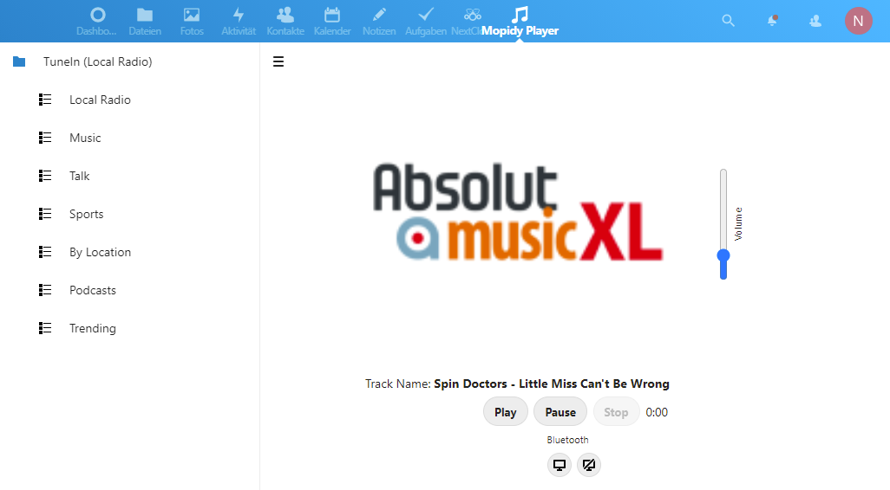

# Introduction

The `mopidyplayer` extension enables your nextcloud(pi) as a media player using the [mopidy backend](https://mopidy.com/)

It requires some manual modification on the system. So be aware that 3rd party software is being installed due the the below instruction.

Also, a new user "mopidy" is being used to manage the audio output and mixer parts (esspacially important for bluetooth connections)

# Installation and Configuration

Install the required packages on your system

```
sudo apt install mopidy mopidy-tunein gstreamer1.0-plugins-bad
sudo apt install pulseaudio pulsemixer
```
## Enable and run mopidy

Make sure the mopidy service is running and enabled during startup

```
sudo systemctl status mopidy.service
sudo systemctl enable mopidy.service # if necessary
```

## Enable pulseaudio as service for user mopidy

Insert below content into `/etc/systemd/system/pulseaudio.service`

```
[Unit]
Description=PulseAudio system server
After=network.target

[Service]
Type=notify
User=mopidy
ExecStart=pulseaudio --daemonize=no --realtime --log-target=journal

[Install]
WantedBy=multi-user.target
```


## Enable Bluetooth support

To allow mopidy the bluetooth access the following steps are required

```
sudo usermod -a -G bluetooth mopidy # allow the mopidy user to control bluetooth
```

Also, allow www-data to manage bluetooth

```
sudo usermod -a -G bluetooth www-data # allow the mopidy user to control bluetooth
```

Replace the below content in `/etc/dbus-1/system.d/bluetooth.conf` using your favorite editor

```
<policy group="bluetooth">
    <allow send_destination="org.bluez"/>
    <allow send_interface="org.bluez.Agent1"/>
    <allow send_interface="org.bluez.GattCharacteristic1"/>
    <allow send_interface="org.bluez.GattDescriptor1"/>
    <allow send_interface="org.freedesktop.DBus.ObjectManager"/>
    <allow send_interface="org.freedesktop.DBus.Properties"/>
</policy>
```


## Project related

**NPM Packages**

```
npm install
```

**Composer (optional)**

composer require


### Enable apache proxy for Websockets (mopidy)

```
a2enmod proxy
a2enmod proxy_http
a2enmod proxy_wstunnel
```

